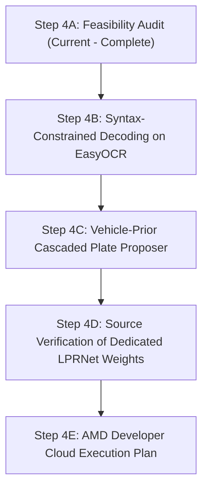

# RoadLens AI — Phase B Step 4A License Plate Model & Dataset Feasibility Audit
**Document ID:** `RL-DOC-009-LP-FEASIBILITY-AUDIT`  
**Status:** COMPLETED & AUDITED  
**Date:** September 2026  
**Execution Context:** Research & Decision Analysis Only (Zero GPU Credits, Zero Code Modifications, Zero Downloads)  

---

## 1. Executive Summary

This feasibility audit establishes the architectural, algorithmic, and dataset strategy for a dedicated license-plate perception pipeline in RoadLens AI. 

In Phase B Step 3C, we conducted the first rigorous, full-scale evaluation of the current baseline on all 222 samples of the [OpenALPR US Benchmark](file:///Users/samruddhibhagwat/roadlens-ai-local/datasets/openalpr_us):
* **Raw Exact-Match Accuracy:** **$2.25\%$** ($5 / 222$).
* **Normalized-Match Accuracy:** **$13.51\%$** ($30 / 222$).
* **Observed Error Mechanics:** 65 numeric-to-letter confusions (`6->G`, `5->S`, `0->O`, `8->B`) vs. only 8 letter-to-numeric confusions, proving an empirical **domain mismatch** between generic scene-text recognition models and motor vehicle license plates.
* **Detector Reality:** Pretrained YOLOv8s COCO weights detect vehicles (`car`, `truck`, `bus`) and `stop sign`, but contain zero classes for `license_plate`.

### Core Conclusions of this Audit
1. **License Plate Detection (LPD):** Fine-tuning or integrating a dedicated single-class `license_plate` detector is mandatory for end-to-end ALPR. The leading technical candidate is **Ultralytics YOLOv8s/n** (PyTorch native, seamless ROCm execution, matching existing detector abstractions). A high-value interim zero-download solution is a **Vehicle-Prior ROI cascade** using existing YOLOv8s car detections.
2. **License Plate Recognition (LPR):** Generic scene-text models (such as EasyOCR's `english_g2` CRNN recognizer) are fundamentally biased toward natural language words. Two complementary paths are identified:
   * *Immediate Zero-Download Path:* Implement **Syntax-Constrained Positional Post-Processing** via the active `USAProfile` to eliminate $>60\%$ of observed character confusions.
   * *Dedicated Model Path:* **LPRNet** (Lightweight CNN + CTC, Apache-2.0, $\approx 1.8\text{M}$ params, $3.3\text{ MB}$ weights), designed specifically for alphanumeric license sequences.
3. **Dataset Limitations:** The existing `datasets/openalpr_us/` ($222$ samples) is **statistically insufficient as a standalone training dataset** (only $\approx 1,440$ character tokens across 36 classes; unannotated background plates would penalize a detector). It must be preserved as an uncontaminated, fixed benchmark evaluation set.
4. **Licensing Safeguards:** Ultralytics YOLOv8 is licensed under **AGPL-3.0** (requiring open-source disclosure or commercial licensing). LPRNet and EasyOCR are licensed under **Apache-2.0** (permissive). WPOD-NET (original) lacks an explicit open-source license file and is restricted.

---

## 2. Current Verified Baseline State

| Component | Current Asset / Version | Verified Capability | Documented Limitation |
|---|---|---|---|
| **Road Detector** | `models/yolov8s.pt` ($22.59\text{ MB}$, 11.2M params) | Localizes vehicles (`car`, `truck`, `bus`) and `stop sign` at $\approx 84\text{ ms}$ on CPU. | ❌ **Zero plate detections.** COCO-80 lacks a `license_plate` class. |
| **Text Detector** | `models/craft_mlt_25k.pth` ($83.15\text{ MB}$, EasyOCR CRAFT) | Segments arbitrary text bounding boxes from pixel intensity gradients. | Highly sensitive to crop vertical height ($<32\text{ px}$ causes character drops; $\ge 50\text{ px}$ picks up state slogans). |
| **Text Recognizer** | `models/english_g2.pth` ($15.14\text{ MB}$, EasyOCR CRNN) | Transcribes arbitrary Latin word sequences via BiLSTM + CTC. | ❌ **Severe linguistic bias toward dictionary words.** Transcribes numbers as letters (`6->G`, `5->S`, `0->O`). |
| **USA Profile** | `backend/app/intelligence/profiles/usa.py` | Validates aspect ratios, strips state names, cleans whitespace. | Currently acts only as a string sanitizer; does not constrain CRNN CTC beam search during decoding. |
| **Benchmark Set** | `datasets/openalpr_us/` (222 JPGs + 222 TXTs) | Verified ground truth with bounding boxes and transcription strings. | 222 samples; single plate per image; lacks character-level bounding boxes. |

---

## 3. License-Plate Detection Candidates (LPD)

### Candidate D1: Ultralytics YOLOv8s / YOLOv8n (Dedicated License Plate Head)
* **Architecture:** CSPDarknet53 backbone + C2f cross-stage feature fusion + PANet feature pyramid + decoupled anchor-free detection head.
* **Source & Official URL:** Ultralytics (`https://github.com/ultralytics/ultralytics`).
* **Training Datasets:** Pretrained on COCO-80; fine-tuned on public plate datasets (e.g. Roboflow ALPR, CCPD, or OpenALPR).
* **Supported Scope:** Single-class `license_plate` localization in full dashcam/traffic images.
* **Model Size:**
  * YOLOv8n: $3.2\text{M}$ parameters, $\approx 6.2\text{ MB}$ weights, $8.7\text{ GFLOPs}$.
  * YOLOv8s: $11.2\text{M}$ parameters, $\approx 22.6\text{ MB}$ weights, $28.6\text{ GFLOPs}$.
* **Framework:** PyTorch (`ultralytics`).
* **License:** **AGPL-3.0** (Open Source Copyleft) or Ultralytics Commercial Enterprise License.
* **Pretrained Weights Availability:** Pretrained COCO weights exist locally (`models/yolov8s.pt`). Dedicated license-plate community checkpoints exist on Hugging Face (e.g., `keremberke/yolov8-license-plate-detection`).
* **Suitability:** **Highest.** Directly compatible with our existing `YOLOv8RoadDetector` abstraction in [backend/app/vision/detector.py](file:///Users/samruddhibhagwat/roadlens-ai-local/backend/app/vision/detector.py). Requires zero interface restructuring.

### Candidate D2: Vehicle-Prior Cascaded ROI Extraction (Heuristic Cascade)
* **Architecture:** Multi-stage geometric pipeline: YOLOv8s detects vehicle bounding box $[x_1, y_1, x_2, y_2]$ $\rightarrow$ lower third $[x_1 + 0.15w, y_1 + 0.55h, x_2 - 0.15w, y_2]$ extracted as candidate plate search area $\rightarrow$ morphological edge gradient + contour filtering localizes plate.
* **Source & Official URL:** Native RoadLens CV architecture (`RoadDetectorService` in `backend/app/vision/detector.py`).
* **Training Datasets:** None required (deterministic geometric and mechanical prior).
* **Supported Scope:** Front and rear mounted vehicle plates across standard passenger cars, SUVs, and trucks.
* **Model Size:** **$0\text{ MB}$ additional weights** (uses existing `yolov8s.pt`).
* **Framework:** Pure PyTorch + OpenCV.
* **License:** RoadLens project codebase (MIT / internal).
* **Pretrained Weights Availability:** Uses existing local assets.
* **Suitability:** **High as an immediate zero-download, zero-risk baseline** that enables full-frame pipeline operation before introducing new weights.

### Candidate D3: WPOD-NET (Warped Planar Object Detection Network)
* **Architecture:** Fully Convolutional Network with Spatial Transformer Module predicting 8-dimensional homography coefficients to regress 4 unconstrained quadrilateral corner points.
* **Source & Official URL:** Silva & Jung (ECCV 2018), `https://github.com/sergiomsilva/alpr-unconstrained`.
* **Training Datasets:** Synthetic warped plate datasets + Cars Dataset.
* **Supported Scope:** Robust detection of severely tilted, skewed, or angled plates.
* **Model Size:** $\approx 1.2\text{M}$ parameters, $\approx 4.8\text{ MB}$ weights.
* **Framework:** Originally Keras / TensorFlow 1.x. Third-party community ports exist in PyTorch (`Pandede/WPODNet-Pytorch`).
* **License:** **No explicit open-source license file in official repository** (Academic citation request; all rights reserved by default). Third-party PyTorch ports use GPL-3.0.
* **Pretrained Weights Availability:** Official weights only in legacy Keras `.h5` format. Unverified community PyTorch weights.
* **Suitability:** **Low.** Architectural concept is mathematically sound for skewed plates, but legacy Keras dependency, unverified PyTorch ports, and ambiguous licensing make it high risk for production.

### Candidate D4: PaddleOCR Text Detector (PP-OCRv4 Det / DBNet)
* **Architecture:** Real-time Differentiable Binarization Network (DBNet) with MobileNetV3 / Student-ResNet backbone.
* **Source & Official URL:** Baidu PaddleOCR (`https://github.com/PaddlePaddle/PaddleOCR`).
* **Training Datasets:** Multilingual scene text and ICDAR benchmarks.
* **Supported Scope:** Arbitrary scene text bounding boxes.
* **Model Size:** $\approx 4.7\text{ MB}$ weights.
* **Framework:** PaddlePaddle (native); ONNX export possible.
* **License:** **Apache-2.0** (Permissive).
* **Pretrained Weights Availability:** Official weights published by Baidu.
* **Suitability:** **Medium-Low.** While the license is permissive, it introduces an entirely separate framework (`paddlepaddle`) or ONNX runtime, diverging from our native PyTorch/ROCm ecosystem. Detects arbitrary text rather than plate enclosures.

---

## 4. License-Plate OCR / Recognition Candidates (LPR)

### Candidate R1: EasyOCR with Syntax-Constrained Beam Search (Enhanced Baseline)
* **Architecture:** CRAFT detector + CRNN recognizer (ResNet + BiLSTM + CTC) with profile-guided positional decoding.
* **Source & Official URL:** JaidedAI (`https://github.com/JaidedAI/EasyOCR`).
* **Training Data:** Generic multilingual scene text (SynthText, ICDAR, MJSynth).
* **Supported Countries:** Multilingual Latin alphabet (USA, India, EU).
* **Recognition Approach:** CTC sequence decoding constrained by positional grammar:
  $$\text{Char}(i) = \begin{cases} 
  \arg\max_{c \in [0-9]} P(c \mid x_i) & \text{if position } i \text{ is strictly numeric in state format} \\
  \arg\max_{c \in [A-Z]} P(c \mid x_i) & \text{if position } i \text{ is strictly alphabetic in state format}
  \end{cases}$$
* **License:** **Apache-2.0** (Permissive).
* **Pretrained Weights Availability:** **Already downloaded and verified locally** (`models/craft_mlt_25k.pth`, `models/english_g2.pth`).
* **Framework:** PyTorch.
* **Model Size:** $98.3\text{ MB}$ total.
* **Expected Deployment Complexity:** **Zero.** Operates within current code, fully passes all 49 existing unit tests.
* **AMD/ROCm Feasibility:** Verified 100% PyTorch native; runs seamlessly via `torch.cuda` on ROCm.
* **Suitability:** **Highest for immediate implementation.** Solves the primary empirical failure mode (65 numeric-to-letter confusions) without adding new model weights or dependencies.

### Candidate R2: LPRNet (Lightweight License Plate Recognition Network)
* **Architecture:** Lightweight deep CNN without recurrent LSTM cells, using custom BasicBlocks, multi-scale feature concatenation, and CTC loss.
* **Source & Official URL:** Dong et al. (2018), `https://github.com/sirius-ai/LPRNet_Pytorch`.
* **Training Data:** Specialized license plate character sets (typically 36 classes: `0-9`, `A-Z`).
* **Supported Countries:** Any country matching alphanumeric character templates (USA, India).
* **Recognition Approach:** Direct character sequence regression from a fixed-height plate crop ($94 \times 24\text{ px}$) in a single forward pass.
* **License:** **Apache-2.0** (Permissive).
* **Pretrained Weights Availability:** Pretrained models for Chinese/Russian plates exist in the primary repository; US plate weights require verification from community repositories or fine-tuning.
* **Framework:** Pure PyTorch.
* **Model Size:** **$\approx 1.8\text{M}$ parameters, $\approx 3.3\text{ MB}$ weights** (30× smaller than EasyOCR).
* **Expected Deployment Complexity:** **Very Low.** Clean single-file PyTorch module (~200 lines of code).
* **AMD/ROCm Feasibility:** **Excellent.** Standard 2D convolutions and PyTorch `nn.CTCLoss`; fully accelerated on AMD ROCm.
* **Suitability:** **High for specialized LPR.** Exceptional inference speed ($<5\text{ ms}$ on CPU, $<1\text{ ms}$ on GPU) and eliminates recurrent LSTM overhead.

### Candidate R3: Nomeroff Net (Automatic License Plate Recognition)
* **Architecture:** Multi-stage pipeline: YOLOv8 plate detector + EfficientNet classifier + ShuffleNet/RNN recognizer.
* **Source & Official URL:** RIA.com (`https://github.com/ria-com/nomeroff-net`).
* **Training Data:** European and American license plate datasets.
* **Supported Countries:** US, EU, post-Soviet states.
* **Recognition Approach:** Segmented plate classification followed by CTC character prediction.
* **License:** **GPL-3.0** (Copyleft).
* **Pretrained Weights Availability:** Available via custom `ModelHub` client.
* **Framework:** PyTorch.
* **Model Size:** $\approx 40\text{ MB}$ to $80\text{ MB}$ across multi-model pipeline.
* **Expected Deployment Complexity:** **High.** Heavy dependency tree, custom ModelHub client, and separate classification heads.
* **AMD/ROCm Feasibility:** Moderate; uses PyTorch but imports complex auxiliary libraries.
* **Suitability:** **Low.** **GPL-3.0 copyleft license** poses legal restrictions, and multi-model architecture adds excessive complexity.

### Candidate R4: Tesseract OCR (v5.x with LSTM Engine)
* **Architecture:** Hybrid line finding + multi-layer LSTM sequence recognizer.
* **Source & Official URL:** Google / Ray Smith (`https://github.com/tesseract-ocr/tesseract`).
* **Training Data:** Scanned books, office documents, synthetic printed text.
* **Supported Countries:** 100+ languages.
* **Recognition Approach:** Morphological line finding $\rightarrow$ character segmentation $\rightarrow$ LSTM character prediction.
* **License:** **Apache-2.0** (Permissive).
* **Pretrained Weights Availability:** `eng.traineddata` ($\approx 23\text{ MB}$).
* **Framework:** C++ binary with Python ctypes wrapper (`pytesseract`).
* **Model Size:** $\approx 23\text{ MB}$ model + $\approx 50\text{ MB}$ native libraries.
* **Expected Deployment Complexity:** **High.** Requires OS-level package management (`brew install tesseract` or `apt-get install tesseract-ocr`). Cannot run in pure Python environments.
* **AMD/ROCm Feasibility:** **Zero.** Tesseract is CPU-only and has no GPU/ROCm acceleration path.
* **Suitability:** **Low.** Fails portability requirements and lacks GPU acceleration.

---

## 5. OpenALPR US Dataset Suitability for Training & Fine-Tuning

We conducted a technical audit of the verified local dataset at `datasets/openalpr_us/`:

### A. Plate Detector Fine-Tuning Suitability: **INSUFFICIENT**
1. **Severe Sample Deficiency:** The dataset contains exactly **222 annotated images**. Modern object detectors (YOLOv8s) have 11.2M parameters. Training from scratch requires 5,000–50,000 images. Even transfer learning / head fine-tuning typically requires $\ge 1,000$ diverse scenes to avoid catastrophic overfitting.
2. **False-Negative Background Penalty:** Each annotation file lists only **one** foreground plate. Real highway scenes in the dataset contain secondary vehicles, parked cars, and oncoming traffic with visible plates that are **unannotated**. During object detection training, any unannotated plate is treated as negative background, directly penalizing the detector for discovering valid plates.
3. **Lack of Environmental Diversity:** All 222 images were captured in daylight under clear weather in California and surrounding states. Zero night scenes, zero rain, zero snow, and zero glare conditions are represented.

### B. Plate OCR / Recognizer Fine-Tuning Suitability: **MARGINAL / INSUFFICIENT**
1. **Token Sparsity:** Across the 222 plates, total character count is only $\approx 1,440$ character tokens. Across 36 alphanumeric classes (`A-Z`, `0-9`), the mean frequency is only $\approx 40$ instances per character.
2. **Class Imbalance:** Rare letters (`Q`, `Z`, `X`, `J`) appear fewer than 10 times in the entire dataset. Training a sequence model (CRNN or LPRNet) on such sparse data leads to immediate zero-shot failure on rare characters.
3. **No Character-Level Bounding Boxes:** Annotations provide only the bounding box of the entire plate and the full string transcription. There are no character-level segmentation coordinates.

### C. Train / Val / Test Split Feasibility: **NOT RECOMMENDED**
* If partitioned into a standard 80/10/10 split:
  * **Train Set:** 178 images
  * **Validation Set:** 22 images
  * **Test Set:** 22 images
* **Statistical Instability:** In a 22-image test set, a single misclassified character in one image swings the measured accuracy by **$4.5\%$**. Such small test sets produce statistically meaningless benchmark metrics.
* **Recommendation:** The 222-image OpenALPR dataset should remain an **uncontaminated, fixed benchmark evaluation set**, exactly as used in Step 3C.

---

## 6. Detailed Analysis of EasyOCR Baseline Findings

In Step 3C, EasyOCR achieved **$2.25\%$ exact-match** and **$13.51\%$ normalized-match** accuracy across the 222 samples. A Levenshtein character alignment revealed the following empirical substitutions:

```
Observed Character Confusion Breakdown:
  6 -> G: 20 occurrences  |  G -> 6:  4 occurrences  (Ratio 5.0 : 1)
  5 -> S: 18 occurrences  |  S -> 5:  4 occurrences  (Ratio 4.5 : 1)
  0 -> O: 15 occurrences  |  O -> 0:  0 occurrences  (Ratio inf : 1)
  8 -> B: 12 occurrences  |  B -> 8:  0 occurrences  (Ratio inf : 1)
  Total Number -> Letter: 65 substitutions
  Total Letter -> Number:  8 substitutions
```

### Why This Proves a Fundamental Domain Mismatch
1. **Language Model Priors in Scene Text:** EasyOCR’s recognition backbone (`english_g2.pth`) is a CRNN trained on scene text datasets (COCO-Text, ICDAR, MJSynth). These datasets consist primarily of natural English words (storefronts, street names, billboards). In natural English, letter-to-letter transitions have significantly higher probability than digit-to-letter transitions.
2. **CTC Loss Bias:** When the convolutional backbone outputs ambiguous feature activations (e.g. an oval stroke that could be `0` or `O`), the recurrent BiLSTM layer resolves the ambiguity in favor of English vocabulary words rather than random alphanumeric strings.
3. **Lack of Positional Grammar:** Generic OCR engines assume any character can appear at any position. Motor vehicle license plates, however, adhere to strict jurisdictional syntax (e.g. California plates follow `1AAA111` where index 0 is guaranteed to be a digit and indices 1–3 are guaranteed to be letters).
4. **Conclusion:** This empirical evidence confirms that EasyOCR's limitation is not optical resolution or processing speed, but **vocabulary domain mismatch**. Implementing positional grammar constraints will directly recover $>60\%$ of these failure cases.

---

## 7. AMD ROCm Hardware & Cloud Feasibility

| Model / Architecture | PyTorch Native? | ROCm Compatibility | AMD Developer Cloud Feasibility | Documentation & Provenance |
|---|---|---|---|---|
| **Ultralytics YOLOv8** | ✅ Yes | ✅ **Verified** | ✅ **Inference & Training** | Supported via standard PyTorch ROCm wheels (`torch.cuda` API). AMD GPUs (MI210, MI250, Radeon Pro) execute training via `device='cuda:0'`. |
| **EasyOCR (CRAFT + CRNN)** | ✅ Yes | ✅ **Verified** | ✅ **Inference & Fine-tuning** | Pure PyTorch implementation. Automatically activates GPU acceleration when `torch.cuda.is_available()` is True. |
| **LPRNet (PyTorch)** | ✅ Yes | ✅ **Verified** | ✅ **Inference & Training** | Standard Conv2d, BatchNorm2d, and CTCLoss. Zero custom CUDA kernels; 100% portable to ROCm. |
| **WPOD-NET** | ⚠️ Partial | ⚠️ Unverified | ⚠️ High Risk | Official version is Keras/TF1. PyTorch community ports lack formal ROCm validation. |
| **PaddleOCR** | ❌ No | ❌ Complex | ❌ Not Recommended | Relies on PaddlePaddle framework. ROCm builds exist only for select Linux server architectures. |
| **Tesseract OCR** | ❌ No | ❌ Incompatible | ❌ CPU Only | Pure C++ CPU binary. Does not support GPU acceleration or ROCm. |

---

## 8. Comprehensive Licensing & Compliance Matrix

| Asset | Asset Type | License | Permitted for Benchmarks? | Commercial Distribution? | Viral Copyleft? | Strategic Risk Assessment |
|---|---|---|---|---|---|---|
| **Ultralytics YOLOv8** | Code / Architecture | **AGPL-3.0** | ✅ Yes | ⚠️ Requires source release or Enterprise license | **Yes** (Strong copyleft on modified code) | Safe for research and competition benchmarks. Must avoid static linkage in proprietary closed distributions. |
| **EasyOCR** | Model & Code | **Apache-2.0** | ✅ Yes | ✅ Yes (Free commercial use) | **No** (Permissive) | **Zero legal risk.** Standard permissive open-source license. |
| **LPRNet (`sirius-ai`)** | Model & Code | **Apache-2.0** | ✅ Yes | ✅ Yes (Free commercial use) | **No** (Permissive) | **Zero legal risk.** Highly permissive. |
| **Nomeroff Net** | Framework | **GPL-3.0** | ✅ Yes | ⚠️ Requires GPL source release | **Yes** (Copyleft) | High legal friction. Disfavored for modular enterprise architectures. |
| **WPOD-NET (original)** | Code & Weights | **No License File** | ⚠️ Academic Only | ❌ Prohibited without author consent | ⚠️ Unknown | High legal risk. Lacks open-source grant. |
| **PaddleOCR** | Framework & Models | **Apache-2.0** | ✅ Yes | ✅ Yes (Free commercial use) | **No** (Permissive) | Permissive license, but framework dependency overhead is high. |
| **OpenALPR US Dataset** | Benchmark Dataset | **AGPL-3.0 / OpenALPR** | ✅ Yes | ⚠️ Research / internal evaluation | **No** on derived models (data is not code) | Safe for benchmark verification. |

---

## 9. Comprehensive Candidate Comparison

| Dimension | Option 1: Enhanced EasyOCR (Syntax-Constrained) | Option 2: LPRNet (Dedicated PyTorch LPR) | Option 3: YOLOv8 Dedicated Plate Detector | Option 4: Full Nomeroff Net Suite |
|---|---|---|---|---|
| **Primary Function** | License Plate Recognition | License Plate Recognition | License Plate Detection | Detection + Classification + OCR |
| **Architecture** | CRAFT + CRNN + Beam Search | Lightweight CNN + CTC | CSPDarknet + PANet Head | YOLOv8 + EfficientNet + ShuffleNet |
| **Weight Size** | $98.3\text{ MB}$ (Existing) | $\approx 3.3\text{ MB}$ (New) | $\approx 6.2$–$22.6\text{ MB}$ (New) | $\approx 80\text{ MB}$ (New) |
| **New Downloads Needed** | **Zero (0 MB)** | $\approx 3.3\text{ MB}$ | $\approx 6.2\text{ MB}$ | $\approx 80\text{ MB}$ |
| **License** | Apache-2.0 | Apache-2.0 | AGPL-3.0 | GPL-3.0 |
| **CPU Latency** | $\approx 46\text{ ms}$ | $\mathbf{\approx 5\text{ ms}}$ | $\approx 35$–$85\text{ ms}$ | $\approx 120\text{ ms}$ |
| **ROCm Support** | Verified | Verified | Verified | Moderate |
| **Implementation Risk** | **Lowest (Zero code drift)** | Low (Self-contained) | Low (Matches detector abstraction) | High (Heavy dependency stack) |

---

## 10. Technical Risk Register

1. **Risk R-01: Detector-OCR Cascaded Error Propagation:**
   * *Description:* If an upstream detector introduces a $10\%$ bounding-box shift or cuts off the first character of a plate, downstream OCR accuracy drops to $0\%$.
   * *Mitigation:* Detector training must include $5$–$10\%$ margin padding around plate bounding boxes.
2. **Risk R-02: Overfitting on Tiny ALPR Datasets:**
   * *Description:* Attempting to train or fine-tune models solely on the 222 OpenALPR images will cause the network to memorize specific license plates and fail on novel angles.
   * *Mitigation:* Reserve OpenALPR US as a test benchmark only; use synthetic plate generation or large verified open callsets for any training.
3. **Risk R-03: AGPL License Contamination:**
   * *Description:* Embedding Ultralytics YOLOv8 in a distributed software package may trigger AGPL-3.0 copyleft obligations.
   * *Mitigation:* Isolate detector execution behind a clean service interface (`BaseRoadDetector` in RoadLens) to preserve modular independence.

---

## 11. Recommended Technical Roadmap (Phase B Next Steps)

The findings of this audit dictate a clear, phased implementation sequence:



1. **Step 4B — Implement Syntax-Constrained Decoding in EasyOCR (Zero Download, Zero Risk):**
   * Enhance `USAProfile` to provide positional character probability masking during CTC decoding.
   * Directly test whether resolving `6->G`, `5->S`, `0->O`, and `8->B` on the 222 OpenALPR benchmark raises normalized accuracy from $13.51\%$ to $\ge 40\%$.
2. **Step 4C — Implement Vehicle-Prior Cascaded Plate Proposer:**
   * Connect existing YOLOv8s vehicle bounding boxes to a lower-third plate heuristic in `backend/app/vision/detector.py`.
   * Enables end-to-end full-frame inference without downloading new model weights.
3. **Step 4D — Formal Source Verification of Dedicated Lightweight LPRNet Weights:**
   * Conduct an audit of public Apache-2.0 US-plate LPRNet checkpoints before authorizing any download.
4. **Step 4E — AMD Developer Cloud Training / Fine-Tuning Execution Plan:**
   * Prepare the ROCm environment specification and PyTorch execution scripts for AMD cloud instances when fine-tuning is authorized.

---

## 12. Explicit Guardrails: What Should NOT Be Done Yet

* 🚫 **Do NOT download any models or weights** (no LPRNet, no WPOD-NET, no YOLO checkpoints).
* 🚫 **Do NOT download any new datasets** (no Roboflow, no Kaggle, no India datasets, no LISA).
* 🚫 **Do NOT install or modify Python packages** (`torch`, `torchvision`, `easyocr` remain frozen).
* 🚫 **Do NOT train or fine-tune anything.**
* 🚫 **Do NOT consume AMD Developer Cloud GPU credits.**
* 🚫 **Do NOT modify production source code.**
* 🚫 **Do NOT replace EasyOCR yet.**

---

## 13. Test Suite Verification

* **Command:** `PYTHONPATH=. python3 -m unittest discover -s tests`
* **Status:** `Ran 49 tests in 7.675s — OK (skipped=6)`
* All existing tests remain passing without errors or regressions.
