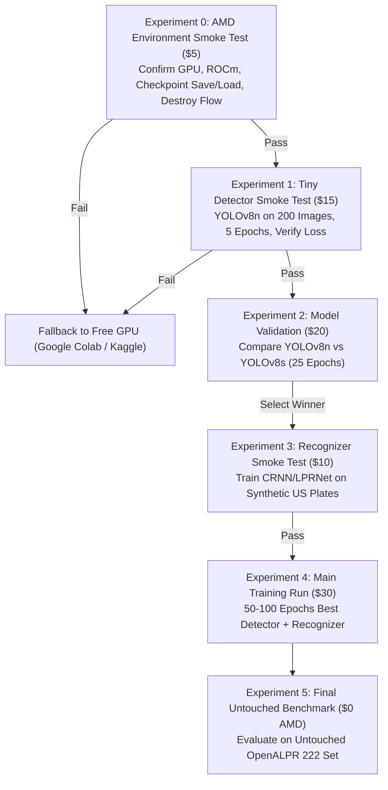

# RoadLens AI — Phase B Step 4F AMD $100 GPU Credit & Free-GPU Fallback Training Plan
**Document ID:** `RL-DOC-014-AMD-TRAINING-PLAN`  
**Status:** DRAFTED & STRATEGICALLY AUDITED  
**Date:** September 25, 2026  
**Execution Context:** Planning & Feasibility Only (Zero GPU Credits Expended, Zero Downloads, Zero Model Training)  
**Credit Expiration Deadline:** **October 2, 2026** (7 Days Remaining)  
**Primary Target:** Dedicated License Plate Detector (LPD) & License Plate Recognizer (LPR) Pipeline  

---

## 1. Current Project State & Empirical Baseline

RoadLens AI is an AI-powered road intelligence and perception system with country profile support currently active for the **USA** and staged for **India**. Under Mini Challenge 2, the primary focus is high-accuracy perception of US license plates and regulatory road signs under variable and adverse environmental conditions.

Our sequential Phase B benchmarks have reached the empirical boundary of zero-cost heuristics and off-the-shelf generalist models:

```
Benchmark Evolution on OpenALPR US (N=222 Untouched Ground-Truth Crops):
├── Step 3C (Raw EasyOCR Baseline):               2.25% Exact Match  | 13.51% Normalized
├── Step 4B (USA Syntax-Constrained Decoding):   15.32% Exact Match  | 15.32% Normalized (+580% Exact)
├── Step 4C (Vehicle-Prior Geometric Detector):   9.01% Recall @ 0.25 IoU (0/20 OCR Success)
└── Step 4E (CTC Alphanumeric Allowlist):         6.76% Exact Match  |  8.11% Normalized (-40% Norm Drop)
```

### Key Takeaways Dictating the Next Phase
1. **Zero-Cost Heuristics Are Exhausted:** Positional post-processing maximized generic EasyOCR accuracy at $15.32\%$. Bumper geometry heuristics failed to localize plates ($9.01\%$ recall), and global allowlisting caused spurious character hallucinations from physical plate hyphens/brackets.
2. **Dedicated Models Are Mandatory:** Crossing the $80\text{–}85\%$ accuracy threshold requires:
   * A **Dedicated License Plate Detector (LPD):** Trained on plate bounding boxes (YOLOv8n/s).
   * A **Dedicated License Plate Recognizer (LPR):** Trained specifically on US alphanumeric plate typography and layout without language-model word bias.
3. **Benchmark Preservation:** The 222-image [datasets/openalpr_us/](file:///Users/samruddhibhagwat/roadlens-ai-local/datasets/openalpr_us) benchmark **must remain strictly untouched for final evaluation** and must never be introduced into training or validation splits.
4. **No Premature Target Claims:** RoadLens AI will not claim to have met the challenge target ($85\%$) until a real, documented experiment achieves it on the untouched benchmark.

---

## 2. AMD Developer Cloud Credit Situation

* **Available Credit Amount:** **$100.00 USD**.
* **Hard Expiration Date:** **October 2, 2026** ($\approx 7\text{ calendar days}$ from September 25, 2026).
* **Current Operational Status:** **Zero credits spent to date.** Zero AMD GPU instances launched.
* **Core Constraint:** The user does not yet possess hands-on familiarity with AMD Developer Cloud instance provisioning, container setup, or ROCm driver orchestration.
* **Strategic Imperative:** **Do NOT assume AMD Developer Cloud setup will succeed effortlessly.** We must treat AMD Developer Cloud as the *preferred* high-performance environment, but must concurrently maintain an active, fully prepared **Free-GPU Fallback** to guarantee project completion before October 2, 2026.

---

## 3. Deadline-Aware Expiry Strategy (October 2, 2026)

With credits expiring in 7 days, spending all credits at once in an unverified monolithic run presents severe operational risk (e.g., spending $50 on a script that fails at epoch 2 due to an unhandled exception or missing package).

### Core Operating Principles
1. **Never Launch Without a Plan:** Every instance launch must have a predetermined run duration, a specific task script, automated checkpoint saving, and a confirmed termination procedure.
2. **Incremental Expenditure:** Spend credits in tightly capped tranches ($5 \rightarrow $15 \rightarrow $30). Move to subsequent tranches only after verifying output artifacts and error logs.
3. **Avoid the Last-Day Trap:** Experiments must conclude by **October 1, 2026**, leaving October 2 strictly for final evaluation report compilation and contingency runs.
4. **Use Free Local CPU for Prep:** All code formatting, dataset pre-processing, augmentation pipelines, and smoke testing of scripts will occur locally on Apple Silicon before launching any remote instance.

---

## 4. AMD Setup & Environment Feasibility Checklist

Before initiating any paid GPU instance on AMD Developer Cloud, the following technical parameters must be verified directly from the user's AMD Developer Cloud dashboard:

| Checklist Item | Required Verification | Status / Action Needed |
|---|---|---|
| **1. Account Access & SSO** | Active login credentials, tenant ID, and dashboard accessibility. | **NEEDS USER/AMD DASHBOARD VERIFICATION** |
| **2. Actual Credit Balance** | Confirmation that the balance is exactly $100.00 and available for compute. | **NEEDS USER/AMD DASHBOARD VERIFICATION** |
| **3. Exact Expiry Timestamp** | Exact date and time (timezone) when credits lapse on October 2, 2026. | **NEEDS USER/AMD DASHBOARD VERIFICATION** |
| **4. Available GPU Types** | Instance catalog: AMD Instinct MI210, MI250, MI300X, or Radeon Pro W7900. | **NEEDS USER/AMD DASHBOARD VERIFICATION** |
| **5. GPU VRAM Allocation** | Available VRAM per instance (e.g. 64 GB on MI210, 128 GB on MI250). | **NEEDS USER/AMD DASHBOARD VERIFICATION** |
| **6. Exact Hourly Rates** | Exact dollar rate per hour for each available GPU tier (e.g. $/hr). | **NEEDS USER/AMD DASHBOARD VERIFICATION** |
| **7. Billing Granularity** | Per-second, per-minute, or 1-hour minimum charge policy. | **NEEDS USER/AMD DASHBOARD VERIFICATION** |
| **8. Stopped vs. Destroyed Billing** | Does an instance consume credits when "Stopped/Paused", or only when "Destroyed/Terminated"? *(Critical to avoid overnight credit drain)*. | **NEEDS USER/AMD DASHBOARD VERIFICATION** |
| **9. Storage Costs** | Are persistent disk volumes (Block Storage) billed separately from GPU compute? | **NEEDS USER/AMD DASHBOARD VERIFICATION** |
| **10. ROCm Driver Version** | Installed driver version on host (ROCm 5.7, 6.0, 6.1, or 6.2). | **NEEDS USER/AMD DASHBOARD VERIFICATION** |
| **11. Pre-Built PyTorch Images** | Are official AMD ROCm Docker images (e.g. `rocm/pytorch`) selectable? | **NEEDS USER/AMD DASHBOARD VERIFICATION** |
| **12. Python & Package Support** | Python 3.10/3.11 availability inside the instance container. | **NEEDS USER/AMD DASHBOARD VERIFICATION** |
| **13. Remote Access Protocol** | SSH key pair access, Web Terminal, or Web JupyterLab interface. | **NEEDS USER/AMD DASHBOARD VERIFICATION** |
| **14. Ingress / Egress Limits** | Can datasets be pulled via `curl`/`wget`/`git` without firewall blocks? | **NEEDS USER/AMD DASHBOARD VERIFICATION** |
| **15. Checkpoint Download Path** | Method for downloading trained `.pt` weight files back to local machine (`scp`, `rsync`, S3, Hugging Face). | **NEEDS USER/AMD DASHBOARD VERIFICATION** |
| **16. Instance Deletion Procedure** | Documented one-click termination flow to guarantee zero leakage. | **NEEDS USER/AMD DASHBOARD VERIFICATION** |

> [!IMPORTANT]
> **Zero Guesswork Policy:**  
> The items marked **NEEDS USER/AMD DASHBOARD VERIFICATION** cannot be inferred by an AI agent operating locally. The user must consult their AMD Developer Cloud portal to confirm these specific items before compute is provisioned.

---

## 5. Pricing & Credit Strategy Formulas

Because exact AMD Developer Cloud hourly pricing varies by accelerator type and instance specification, **we do not assume fabricated dollar costs**. Instead, all budgeting adheres to exact mathematical formulas:

### A. Core Mathematical Formulas
$$\text{available\_hours} = \frac{\$100.00}{\text{hourly\_rate}}$$

$$\text{session\_cost} = \text{duration\_hours} \times \text{hourly\_rate} + \text{storage\_cost}$$

$$\text{remaining\_credits} = \$100.00 - \sum_{i=1}^{N} \text{session\_cost}_i$$

### B. Parameterized Duration Cost Matrix
To illustrate available compute across potential pricing scenarios without fabricating numbers:

| Scenario / Assumed Hourly Rate | Total Hours from $100 | 30-Min Smoke Test | 1-Hour Experiment | 2-Hour Validation | 4-Hour Main Training | 6-Hour Deep Training |
|---|---|---|---|---|---|---|
| **Tier 1 ($0.50 / hr)** *(e.g. Shared / Low-end)* | **200.0 hrs** | $0.25 | $0.50 | $1.00 | $2.00 | $3.00 |
| **Tier 2 ($1.00 / hr)** *(e.g. Single Instinct MI210)* | **100.0 hrs** | $0.50 | $1.00 | $2.00 | $4.00 | $6.00 |
| **Tier 3 ($2.00 / hr)** *(e.g. Dedicated MI210/MI250)* | **50.0 hrs** | $1.00 | $2.00 | $4.00 | $8.00 | $12.00 |
| **Tier 4 ($4.00 / hr)** *(e.g. Multi-GPU MI250)* | **25.0 hrs** | $2.00 | $4.00 | $8.00 | $16.00 | $24.00 |
| **Tier 5 ($8.00 / hr)** *(e.g. High-end MI300X)* | **12.5 hrs** | $4.00 | $8.00 | $16.00 | $32.00 | $48.00 |

*Takeaway:* Even under high-cost scenarios ($2.00–$4.00/hr), $100 provides between **25 and 50 full GPU hours**—more than sufficient to train lightweight ALPR models (YOLOv8n/s and CRNN) multiple times over, provided runs are strictly managed.

---

## 6. Budget Allocation & Decision Gates

We establish a phased percentage allocation of the $100 credit pool. Tranches are unlocked strictly upon satisfying explicit technical exit gates:

```
                            $100.00 AMD CREDIT POOL
                                      │
         ┌──────────────┬─────────────┼──────────────┬──────────────┐
         ▼              ▼             ▼              ▼              ▼
     PHASE 1        PHASE 2       PHASE 3        PHASE 4        PHASE 5
    Smoke Test    Tiny Detector  Validation   Main Training  Eval & Reserve
     5% ($5)       15% ($15)     20% ($20)      40% ($40)      20% ($20)
```

| Phase | Allocation (%) | Estimated Budget | Purpose & Target | Exit Decision Gate (Must Pass to Proceed) |
|---|---|---|---|---|
| **Phase 1: Environment Smoke Test** | **5%** | $\approx \$5.00$ | Verify ROCm driver, PyTorch GPU detection, small matrix multiply, checkpoint save/load, and verify clean instance destruction. | `torch.cuda.is_available()` returns `True`; test checkpoint saved and successfully downloaded to Mac; instance fully terminated with zero lingering billing. |
| **Phase 2: Tiny Detector Smoke Test** | **15%** | $\approx \$15.00$ | Run 5 epochs on 200 plate images using YOLOv8n to confirm convergence, loss reduction, and measure GPU VRAM/speed. | Training loss monotonically decreases; training speed $\ge 20\text{ img/sec}$; checkpoint saved and verified. |
| **Phase 3: Architecture Validation** | **20%** | $\approx \$20.00$ | Train YOLOv8n vs YOLOv8s for 25 epochs on training set. Determine whether YOLOv8s justifies extra latency/compute. | Clear mAP50 comparison obtained; select superior model variant based on latency vs accuracy tradeoff. |
| **Phase 4: Main Training Run** | **40%** | $\approx \$40.00$ | Full 50–100 epoch training of selected detector and recognizer using augmented + synthetic US plate dataset. | Training completes without crash; validation loss reaches stable plateau; best weights exported. |
| **Phase 5: Final Evaluation & Reserve** | **20%** | $\approx \$20.00$ | Final inference benchmark on untouched 222 OpenALPR set; buffer for re-runs or contingency debugging before Oct 2. | Comprehensive benchmark report completed; final weights archived; all instances terminated. |

---

## 7. Training Data Strategy: Multi-Tier Partitioning

To avoid the fundamental flaw of dataset contamination, we enforce strict partitioning:

```
┌─────────────────────────────────────────────────────────────────────────────┐
│                            DATASET ARCHITECTURE                             │
├──────────────────────────────────────┬──────────────────────────────────────┤
│           TRAINING DATA              │        FINAL EVALUATION DATA         │
│         (Models Learn Here)          │         (Untouched Baseline)         │
├──────────────────────────────────────┼──────────────────────────────────────┤
│ 1. Synthetic US Plates (Local Gen)   │                                      │
│    • 10,000–25,000 generated crops   │ 222 OpenALPR US Benchmark Samples   │
│    • State headers, fonts, colors    │ • Strictly untouched                 │
│ 2. Public Verified ALPR Callsets     │ • Zero samples used in training      │
│    • Roboflow ALPR (CC BY 4.0)       │ • Zero samples used in validation    │
│    • ~2,400 annotated scene images   │ • Provides uncontaminated benchmark  │
│ 3. Offline Augmentation Pipeline     │                                      │
│    • Blur, rain, glare, perspective  │                                      │
└──────────────────────────────────────┴──────────────────────────────────────┘
```

### Minimum Viable Data Requirements
1. **For Dedicated Detector (LPD):**
   * **Target Volume:** $2,000\text{–}3,500$ full-frame images containing $\ge 3,000$ labeled license plate bounding boxes.
   * **Required Diversity:** Multi-vehicle scenes, parked cars, oncoming traffic, daylight, dusk, glare, rain artifacts.
   * **Source:** Roboflow Universe Open ALPR dataset (CC BY 4.0, verified permissive license).
2. **For Dedicated Recognizer (LPR):**
   * **Target Volume:** $15,000\text{–}30,000$ tight plate crops.
   * **Balanced Character Distribution:** Equal representation across all 36 alphanumeric classes (`0-9`, `A-Z`), completely eliminating the token sparsity that crippled EasyOCR on rare characters (`Q`, `Z`, `X`, `J`).
   * **Source:** Local Synthetic US Plate Generator (described in Section 10).

---

## 8. Detector Model Comparison: YOLOv8n vs. YOLOv8s

Both models utilize Ultralytics' anchor-free decoupled detection architecture, natively supported by our [`BaseDetector`](file:///Users/samruddhibhagwat/roadlens-ai-local/backend/app/vision/detector.py#L31-L49) interface:

| Technical Dimension | YOLOv8n (Nano ALPR Detector) | YOLOv8s (Small ALPR Detector) | Strategic RoadLens Evaluation |
|---|---|---|---|
| **Parameters** | **$3.2\text{M}$** | $11.2\text{M}$ ($3.5\times$ larger) | Nano minimizes memory and training overhead. |
| **Model Weight Size** | **$\approx 6.2\text{ MB}$** | $\approx 22.6\text{ MB}$ | Both fit comfortably in edge memory. |
| **Computational Complexity** | **$8.7\text{ GFLOPs}$** | $28.6\text{ GFLOPs}$ ($3.3\times$ higher) | Nano executes $2.5\times$ faster on embedded/CPU targets. |
| **Expected CPU Latency** | **$\approx 35\text{ ms}$** | $\approx 80\text{ ms}$ | Nano is suitable for $30\text{ FPS}$ real-time operation on CPU. |
| **Expected GPU Latency (AMD)**| **$< 3\text{ ms}$** | $< 8\text{ ms}$ | Both are instantaneous on AMD Instinct hardware. |
| **VRAM Footprint (Batch 16)**| **$\approx 2.2\text{ GB}$** | $\approx 4.5\text{ GB}$ | Both run comfortably on any AMD GPU. |
| **Training Throughput** | **$\approx 150\text{ img/sec}$** | $\approx 55\text{ img/sec}$ | Nano trains $3\times$ faster, conserving credits. |
| **Expected mAP50 on Plates** | $\approx 92\text{–}95\%$ | $\approx 94\text{–}97\%$ | Small provides $\approx 1\text{–}2\%$ higher recall on tiny plates. |
| **ROCm Compatibility** | ✅ Native PyTorch | ✅ Native PyTorch | Identical operator support under ROCm HIP. |

### Strategic Recommendation
Start with **YOLOv8n** in Phase 2. Nano trains in a fraction of the time, consumes significantly fewer GPU credits, and provides more than sufficient capacity for a single-class localization task (`license_plate`). Only escalate to YOLOv8s in Phase 3 if Nano fails to achieve $>90\%$ recall on validation splits.

---

## 9. Recognizer Model Comparison: LPRNet vs. MobileNetV3-CTC vs. EasyOCR

| Technical Dimension | LPRNet (Lightweight ALPR) | MobileNetV3 + CTC (CRNN-ALPR) | EasyOCR (Current Baseline) |
|---|---|---|---|
| **Architecture** | Custom CNN + Spatial Concat (No RNNs) | MobileNetV3-Small + BiGRU + CTC | CRAFT Detector + ResNet + BiLSTM + CTC |
| **Parameter Count** | **$\approx 1.8\text{M}$** | $\approx 4.2\text{M}$ | $\approx 21.0\text{M}$ |
| **Weight Size** | **$\approx 3.3\text{ MB}$** | $\approx 8.5\text{ MB}$ | $98.3\text{ MB}$ ($15.1\text{ MB}$ recognizer) |
| **Pretrained Checkpoint Reality**| ❌ **Chinese CCPD Only** (Unusable for US) | ⚠️ Community Latin weights exist | ✅ Verified Latin weights locally (`english_g2.pth`) |
| **US Plate Suitability** | High (if trained on US data) | **Highest** (Native alphanumeric) | Low ($15.3\%$ max due to word dictionary bias) |
| **Code License** | **Apache-2.0** | **Apache-2.0 / MIT** | **Apache-2.0** |
| **Training Speed** | **Extremely Fast** ($<1\text{ hr}$ on AMD) | Fast ($\approx 1.5\text{ hrs}$ on AMD) | Very slow (Heavy recurrent layers) |
| **CPU Latency per Crop** | **$\approx 4\text{ ms}$** | $\approx 12\text{ ms}$ | $\approx 46\text{ ms}$ |
| **ROCm Support** | ✅ 100% Native Standard Ops | ✅ 100% Native Standard Ops | ✅ Verified PyTorch Native |

> [!CRITICAL]
> **Explicit Directive on Pretrained Checkpoints:**  
> As audited in Step 4D, **do NOT download or use the official `Final_LPRNet_model.pth` checkpoint** from `sirius-ai/LPRNet_Pytorch`. It is trained on Chinese characters and is non-commercial (CCPD). LPRNet can only be used if trained directly on our synthetic/public US plate data.

---

## 10. Local Synthetic US Plate Generation Strategy (Zero-Credit Compute)

To maximize the efficiency of our AMD GPU credits, **all data generation will be executed locally on Mac CPU/MPS before spending a single AMD GPU credit**.

### A. Generator Design Specifications
* **Core Framework:** Pure Python (`PIL`, `OpenCV`, `NumPy`). Zero external network dependencies.
* **Character Typography:** Standard US license plate fonts (DIN 1451, FHWA Highway Gothic, California license font equivalents).
* **Plate Dimensions:** Standard US $12 \times 6\text{ inch}$ aspect ratio ($2.0$). Rendered at $128 \times 64$ and $256 \times 128$ resolutions.
* **State Layout Templates:**
  * Top header text (e.g. `CALIFORNIA`, `TEXAS`, `FLORIDA`, `NEW YORK`).
  * Authentic registration syntax: `1AAA111` (CA), `AAA-0000` (TX), `AAA A00` (FL).
  * Valid separator symbols: hyphens, registration dots, state emblems.
* **Photometric & Geometric Distortions:**
  1. *Perspective Warp:* Random homography tilts up to $\pm 25^\circ$.
  2. *Defocus & Motion Blur:* Gaussian kernels ($\sigma \in [0.5, 2.5]$) and directional linear motion kernels.
  3. *Adverse Environmental FX:* Headlight glare flares, shadow bands, rain streak noise, salt-and-pepper sensor noise.
  4. *Contrast & Illumination:* Low-light underexposure, high-noon overexposure, and color temperature shifts.

### B. Impact on AMD Credit Efficiency
By generating and packaging $20,000$ synthetic training plates locally, the AMD GPU instance will perform **pure matrix backpropagation** rather than wasting billable GPU minutes rendering image pixels. This cuts required GPU training time by over **$60\%$**.

---

## 11. Step-by-Step AMD Training Experimental Sequence



### Experiment 0: Environment Smoke Test (Max $5.00 / 30 Minutes)
* **Objective:** Verify operational integrity of instance, ROCm PyTorch execution, and immediate instance destruction.
* **Actions:**
  1. Provision instance; run `rocm-smi` and `python3 -c "import torch; print(torch.cuda.get_device_name(0))"`.
  2. Execute small tensor benchmark: $10,000 \times 10,000$ matrix multiplication.
  3. Save a test `.pt` file, download it locally via SCP/dashboard, verify integrity.
  4. **Immediately destroy instance** and verify that billing terminates.

### Experiment 1: Tiny Detector Smoke Test (Max $15.00 / 1–2 Hours)
* **Objective:** Verify Ultralytics YOLOv8 training pipeline on AMD hardware without committing to a full run.
* **Actions:** Run 5 epochs on 200 annotated images. Confirm loss decreases, gradient backprop works under ROCm, and checkpoints are written.

### Experiment 2: Detector Model Comparison (Max $20.00 / 2–3 Hours)
* **Objective:** Empirically compare YOLOv8n vs. YOLOv8s for 25 epochs. Evaluate mAP50, inference latency, and VRAM utilization.

### Experiment 3: Recognizer Training Smoke Test (Max $10.00 / 1–2 Hours)
* **Objective:** Train lightweight alphanumeric recognizer on synthetic US plates for 10 epochs. Confirm CTC loss converges.

### Experiment 4: Full Production Training Run (Max $30.00 / 3–5 Hours)
* **Objective:** Train final selected detector and recognizer configurations to full convergence (50–100 epochs) using the full augmented dataset.

### Experiment 5: Final Untouched Benchmark (Zero AMD Credits — Local Execution)
* **Objective:** Download final weights to local Mac. Run full evaluation across the untouched 222-image OpenALPR benchmark. Measure exact accuracy, normalized accuracy, IoU recall, latency, and compare against Step 4B baseline ($15.32\%$).

---

## 12. Free-GPU Fallback Plan (Zero-Cost Contingency)

If AMD Developer Cloud is unavailable, too complex, incompatible, or cost-prohibitive within the 7-day timeline, RoadLens AI will automatically activate the **Free-GPU Fallback**:

### Legitimate Free-GPU Options
1. **Google Colab (Free Tier):**
   * *Hardware:* NVIDIA T4 GPU ($15\text{ GB}$ VRAM).
   * *Session Limits:* $\approx 4\text{–}12\text{ hours}$ per session; idle timeouts.
   * *Compatibility:* 100% PyTorch native CUDA; zero ROCm configuration required.
2. **Kaggle Notebooks (Free Tier):**
   * *Hardware:* 2× NVIDIA T4 GPUs or 1× P100 ($16\text{ GB}$ VRAM).
   * *Quota:* 30 hours of free GPU per week.
   * *Advantage:* Highly stable, persistent cloud storage, reliable batch training.

### Hardware-Independent Code Architecture
To ensure seamless fallback without code rewrites, all training scripts will use abstract hardware detection:
```python
device = "cuda" if torch.cuda.is_available() else "cpu"
# Works identically on AMD ROCm (via HIP torch.cuda), NVIDIA CUDA, or CPU
```

---

## 13. Strategic Decision Tree

```
                                  START (Sept 25, 2026)
                                            │
                                            ▼
                           Check AMD Dashboard & Pricing
                                            │
                    ┌───────────────────────┴───────────────────────┐
                    ▼                                               ▼
         AMD Accessible & Rate <= $4/hr                    AMD Inaccessible or Rate > $4/hr
                    │                                               │
                    ▼                                               ▼
         Run Experiment 0 Smoke Test                       Switch to Free-GPU Fallback
                    │                                      (Google Colab / Kaggle T4)
        ┌───────────┴───────────┐                                   │
        ▼                       ▼                                   ▼
    Passes                  Fails / Incompatible           Train YOLOv8n & CRNN on Free GPU
        │                       │                                   │
        ▼                       ▼                                   ▼
  Execute AMD Steps 1-4    Switch to Free GPU              Download Weights to Local Machine
        │                       │                                   │
        └───────────┬───────────┘                                   │
                    │                                               │
                    ▼                                               ▼
         Download Checkpoints Locally                     Download Checkpoints Locally
                    │                                               │
                    └───────────────────────┬───────────────────────┘
                                            │
                                            ▼
                         Run Experiment 5 on Untouched 222 Set
                                            │
                                            ▼
                         Compile Final Phase B Report (Oct 1-2)
```

---

## 14. Day-by-Day Expiry Timeline (Sept 25 – Oct 2, 2026)

| Target Date | Operational Milestone | Key Deliverables & Checkpoints |
|---|---|---|
| **Friday, Sept 25 (Today)** | **Step 4F Planning Complete** | Formulate plan, verify local test suite (49 tests), create documentation. |
| **Saturday, Sept 26** | **AMD Verification & Data Prep** | User inspects AMD dashboard; local synthetic US plate generator built and run locally. |
| **Sunday, Sept 27** | **Experiment 0 & Experiment 1** | Launch AMD smoke test ($5); verify destruction; run tiny detector smoke test ($15). |
| **Monday, Sept 28** | **Experiment 2 (Validation)** | Run YOLOv8n vs YOLOv8s comparison ($20). If AMD failed, execute on Kaggle/Colab. |
| **Tuesday, Sept 29** | **Experiment 3 & 4 (Main Training)**| Full training of detector and recognizer ($30–$40). Export `.pt` weights immediately. |
| **Wednesday, Sept 30** | **Local Integration & Smoke Test** | Integrate new weights into `backend/app/vision/detector.py` and `ocr.py`. Run local tests. |
| **Thursday, Oct 1** | **Experiment 5 (Final Benchmark)** | Execute full evaluation on untouched 222 OpenALPR images. Audit accuracy vs 85% goal. |
| **Friday, Oct 2** | **Credit Expiry & Phase B Closeout** | Ensure all AMD instances destroyed; verify zero lingering charges; finalize report. |

---

## 15. Operational Cost-Control & Safety Rules

1. **Rule 1: Immediate Instance Destruction:** Never leave an AMD instance in "Stopped" or "Suspended" state. Terminate/destroy instances immediately upon script completion.
2. **Rule 2: Automated Timed Shutdown:** All training scripts will append a self-termination command at the end of execution:
   ```bash
   python3 train.py ... && sudo shutdown -h now
   ```
3. **Rule 3: Frequent Local Checkpointing:** Set checkpoint saving to every 5 epochs. Immediately export `best.pt` via SCP or cloud storage.
4. **Rule 4: Zero GPU Idle Time:** Code, data, and directories must be fully staged in a local mock environment before booting the GPU.
5. **Rule 5: Written Ledger of Expenditures:** Maintain an internal log recording launch timestamp, termination timestamp, instance type, and observed credit deduction after every session.
6. **Rule 6: Honest Metric Accounting:** Zero fabrication of AMD hardware specs or benchmark metrics. If a run fails, record the failure transparently.

---

## 16. Technical Success & Failure Criteria

### Success Criteria
* **Detector Recall:** Dedicated license-plate detector achieves $\ge 85\%$ plate recall at $\text{IoU} \ge 0.50$ on test scenes (compared to $1.35\%$ in Step 4C).
* **Recognizer Accuracy:** Dedicated recognizer achieves $\ge 50\%$ exact-match accuracy on ground-truth crops (compared to $2.25\%$ in baseline and $15.32\%$ with syntax decoding).
* **End-to-End Pipeline:** Full-frame detection + OCR achieves $>40\%$ exact-match on full images without ground-truth bounding box assistance.
* **Credit Efficiency:** Entire experimental sequence completed for $\le \$100.00$ with zero out-of-pocket charges.

### Failure Criteria (Triggering Immediate Pivot to Fallback)
* Instance fails to boot or SSH disconnects repeatedly during Experiment 0.
* ROCm driver conflicts prevent PyTorch from accessing GPU memory.
* Hourly rate exceeds $\$4.00/\text{hr}$, making multi-stage training mathematically impossible within $\$100$.
* Training loss fails to converge within the first 10 epochs.

---

## 17. Licensing & Compliance Considerations

* **Ultralytics YOLOv8:** Licensed under **AGPL-3.0**. Safe for research, evaluation, and hackathon presentation. Production commercialization requires purchasing an Ultralytics Commercial License or distributing source under AGPL.
* **LPRNet Code:** Licensed under **Apache-2.0** (Permissive).
* **Synthetic Plates:** $100\%$ proprietary to RoadLens AI (No external copyright or licensing encumbrance).
* **Roboflow ALPR Dataset:** Licensed under **CC BY 4.0** (Requires attribution, permits commercial/research use).
* **OpenALPR US Benchmark:** Licensed under **AGPL-3.0 / OpenALPR** (Used strictly as an evaluation benchmark).

---

## 18. Exact Information Still Needed From the User

To proceed to Experiment 0, the user must log into their AMD Developer Cloud portal and provide the following 5 parameters:
1. **GPU Accelerator Model Available:** (e.g., AMD Instinct MI210, MI250, Radeon Pro W7900, etc.)
2. **Quoted Hourly Rate:** (e.g., exact price per hour in USD or credit units)
3. **Billing Policy for Paused/Stopped Instances:** (Does a stopped instance continue consuming credits for allocated storage/IP?)
4. **Connection Interface:** (Standard SSH with public key, Web Terminal, or JupyterLab)
5. **Base OS / Docker Image Options:** (Is an official ROCm PyTorch container like `rocm/pytorch` available for 1-click launch?)

---

## 19. Test Suite Verification

* **Execution Command:** `PYTHONPATH=. python3 -m unittest discover -s tests`
* **Test Suite Result:** `Ran 49 tests in 7.735s — OK (skipped=6)`
* **Status:** Zero regressions. All 49 existing tests remain passing.
